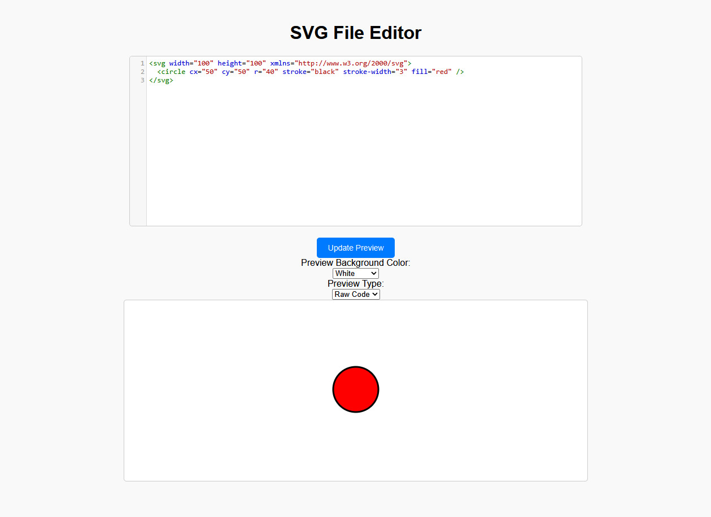

# SVG File Editor

This editor provides a visual interface for working with SVG files directly in the browser. Use it to create, edit, and preview SVG content.  It's a half-baked idea i had, asked chat chattimmy about some things to get started but i really don't have any ideas on where to take this other than the bare-bones basic functionality it has.  I thought it could be used to troubleshoot some issues (which is why it has both `img` src and raw SVG preview options) i've seen in the past but i'm not 100% sure it will help until/unless i encounter them again.

## Features

### Editing Mode
- **Raw SVG Code**: View and edit SVG files as raw XML code.
- **Visual Preview**: See how your changes will appear when rendered.

### Display Options
- **Preview Type**:
  - **Raw Code**: Shows the entire raw SVG XML content.
  - **IMG SRC**: Displays only the image source (default: "img" tag).
  - **Both**: Shows both the raw SVG and the rendered image.

### Background Color
- Choose from several predefined background colors for the preview area:
  - White (default)
  - Light (HSL(0%, 0%, 90%))
  - 50% Grey (HSL(0%, 0%, 50%))
  - Dark (HSL(0%, 0%, 10%))

## Copy-Paste

You can copy from/to any modern web browser and paste your SVG code directly into this editor.

## Dependencies

[codemirror](https://codemirror.net/) for a decent text editor experience with tab indeting and syntax highlighting.